# kitoken

**Tokenizer for language models.**

```rust
use kitoken::Kitoken;
let encoder = Kitoken::from_file("models/llama2.kit")?;

let tokens = encoder.encode("Your future belongs to me.", true)?;
let string = String::from_utf8(encoder.decode(&tokens, true)?)?;

assert!(string == "Your future belongs to me.");
```

## Features

- **Fast encoding and decoding**\
  Faster than most other tokenizers in both common and uncommon scenarios.
- **Support for a wide variety of tokenizer formats and tokenization strategies**\
  Including support for Tokenizers, SentencePiece, Tiktoken and more.
- **Compact definition format**\
  Definitions are stored in an efficient binary format and without merge list.
- **Support for normalization and pre-tokenization**\
  Including unicode normalization, whitespace normalization, and many others.

## Overview

Kitoken is a fast and versatile tokenizer for language models. Multiple tokenization algorithms are supported:

- **BytePair**: A variation of the BPE algorithm, merging byte or character pairs.
- **Unigram**: The Unigram subword algorithm.
- **WordPiece**: The WordPiece subword algorithm.

Kitoken is compatible with many existing tokenizers,
including [SentencePiece](https://github.com/google/sentencepiece), [HuggingFace Tokenizers](https://github.com/huggingface/tokenizers), [OpenAI Tiktoken](https://github.com/openai/tiktoken) and [Mistral Tekken](https://docs.mistral.ai/guides/tokenization),
while outperforming them in most scenarios. See the [benchmarks](#benchmarks) for comparisons with different datasets.

## Compatibility

Kitoken can load and convert many existing tokenizer formats. Every supported format is [tested](./tests) against the original implementation across a variety of inputs to ensure correctness and compatibility.

### SentencePiece

```rust
let encoder = Kitoken::from_sentencepiece_file("models/mistral.model")?;
```

Kitoken can convert and initialize with SentencePiece models in `BPE` and `Unigram` format.

- `BPE` models are converted to `BytePair` definitions in character mode. A merge list is generated and sorted using the token scores, which is then used to sort the vocabulary by merge priority. The scores and the merge list are then discarded.
- `Unigram` models are converted to `Unigram` definitions retaining the token scores.

If the model does not contain a trainer definition, `Unigram` is assumed as the default encoding mode. Normalization options and the unicode normalization scheme are taken from the contained normalizer definition and converted to the respective Kitoken configurations.

<details>
<summary>Notes</summary>

- SentencePiece uses [different `nfkc` normalization rules in the `nmt_nfkc` and `nmt_nfkc_cf` schemes](https://github.com/google/sentencepiece/blob/master/doc/normalization.md) than during regular `nfkc` normalization. This difference is not entirely additive and prevents the normalization of `～` to `~`. Kitoken uses the regular `nfkc` normalization rules for `nmt_nfkc` and `nmt_nfkc_cf` and normalizes `～` to `~`.
- SentencePiece's implementation of Unigram merges pieces with the same merge priority differently depending on preceding non-encodable pieces. For example, with `xlnet_base_cased`, SentencePiece encodes `.nnn` and `Զnnn` as `.., 8705, 180` but `ԶԶnnn` as `.., 180, 8705`. Kitoken always merges pieces with the same merge priority in the same order, resulting in `.., 180, 8705` for either case in the example and matching the behavior of Tokenizers.

</details>

### Tokenizers

```rust
let encoder = Kitoken::from_tokenizers_file("models/llama2.json")?;
```

Kitoken can convert and initialize with HuggingFace Tokenizers definitions for `BPE`, `Unigram` and `WordPiece` models.

- `BPE` models are converted to `BytePair` definitions. The included merge list is used to sort the vocabulary by merge priority and is then discarded.
- `Unigram` models are converted to `Unigram` definitions retaining the token scores.
- `WordPiece` models are converted to `WordPiece` definitions.

Normalization, pre-tokenization, post-processing and decoding options contained in the definition are converted to the respective Kitoken configurations.

Some normalization, post-processing and decoding options used by Tokenizers are used for converting alternative token-byte representations during encoding and decoding. Kitoken always stores and operates on tokens as byte sequences, and will use these options to pre-normalize the vocabulary during conversion.

<details>
<summary>Notes</summary>

- When using a `BPE` definition with an incomplete vocabulary and without an `unk` token, Tokenizers skips over non-encodable pieces and attempts to merge the surrounding ones. Kitoken always considers non-encodable pieces as un-mergeable and encodes the surrounding pieces individually. This can result in different encodings depending on vocabulary coverage and inputs in this scenario.
- Tokenizers normalizes inputs character-by-character, while Kitoken normalizes inputs as one. This can result in differences during case-folding in some cases. For example, greek letter `Σ` has two lowercase forms, `σ` for within-word and `ς` for end-of-word use. Tokenizers will always lowercase `Σ` to `σ`, while Kitoken will lowercase it to either depending on the context.

</details>

### Tiktoken

```rust
let encoder = Kitoken::from_tiktoken_file("models/cl100k_base.tiktoken")?;
```

Tiktoken is a `BPE` tokenizer with a custom definition format used by OpenAI for GPT-3 and newer models using `BytePair` tokenization in byte mode.

Tiktoken definitions contain a sorted vocabulary of base64 encoded bytes and corresponding token ids without any additional metadata. Special tokens and the split regex are expected to be provided separately, but will be inferred from the data for common models including GPT-3, GPT-4 and GPT-4o.
For other models, or depending on the data and requirements, these values can be adjusted manually.

### Tekken

```rust
let encoder = Kitoken::from_tekken_file("models/nemo.json")?;
```

Tekken is a `BPE` tokenizer with a custom definition format based on Tiktoken, used by Mistral for NeMo and newer models using `BytePair` tokenization in byte mode.

Tekken definitions contain a sorted vocabulary of base64 encoded bytes and corresponding token ids, as well as metadata including the split regex and special tokens.

## Performance

Kitoken uses merge-list-free variations of the BPE algorithm and a reversed variation of the Unigram algorithm. The basis for the merge-list-free BPE algorithm was inspired by [Tiktoken](https://github.com/openai/tiktoken), which has similarly good performance characteristics with common tokenization inputs. However, Kitoken can be much faster with inputs that fail to split during pre-tokenization by falling back to a priority-queue-based implementation when optimal.

Kitoken also avoids memory allocations and copying of data to great extent. Most operations are performed in-place and buffers are reused where possible.

### Benchmarks

Benchmarks were performed on a MacBook Pro M1 Max using each libraries Python bindings with [tokenizer-bench](https://github.com/Systemcluster/tokenizer-bench).

#### Llama 2

Llama 2 uses a SentencePiece-based tokenizer model and `BytePair` tokenization in character mode with byte mode fallback.


<details>
<summary>Encoding throughput</summary>

</details>

#### GPT-2

GPT-2 uses a Tokenizers-based tokenizer model and `BytePair` tokenization in byte mode.



<details>
<summary>Encoding throughput</summary>

</details>

#### Datasets

- **Pride and Prejudice**: A text document containing *Pride and Prejudice* by Jane Austen. This data is a good representation for common English-language inputs containing a mix of short and long paragraphs.

- **UTF-8 Sequence**: A text document containing a single-line UTF-8 sequence. This data is a good representation of inputs that might fail to split during pre-tokenization.

- **Wagahai**: A text document containing *Wagahai wa Neko de Aru* by Natsume Sōseki. This data is a good representation for Japanese-language inputs containing many long paragraphs.
